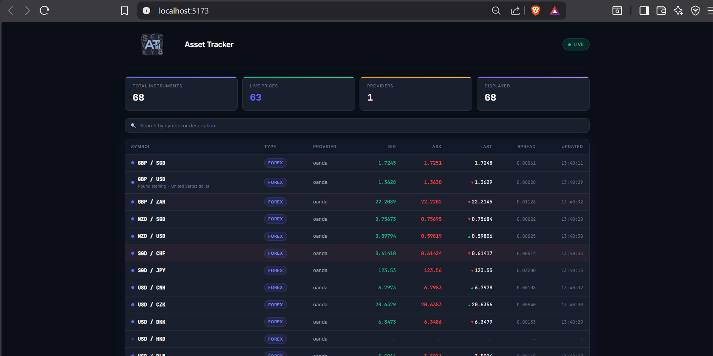
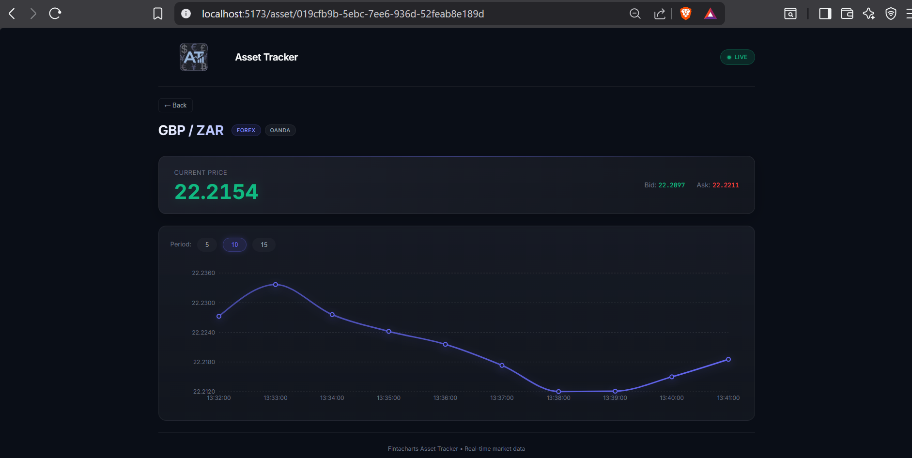

# Asset Tracker API (Fintacharts Integration)

A high-performance market data tracking service built with **.NET 8**. 
The application synchronizes financial instruments from the Fintacharts platform, tracks real-time price updates via WebSockets, and provides historical data through REST.

To demonstrate the project's capabilities, a full-featured frontend has been implemented using **React, Vite, and TypeScript**, featuring a two-page setup for live tracking and historical charting.

🚀 Project Guide: [Explore Project Documentation](https://www.mintlify.com/9asmodey6/Fintacharts.AssetTracker/introduction)

<p align="center">
  
</p>

<details>
  <summary>Click here to see screenshots</summary>

  | Dashboard Page | Asset Detail Page |
  | :---: | :---: |
  |  |  |
</details>


> [!NOTE]  
> The application is fully autonomous — on startup, `InstrumentSyncWorker` automatically fetches instruments from Fintacharts, seeds the database, and triggers WebSocket subscriptions. No manual initialization is required.
---
## 🌟 Key Architectural Features

### 1. Vertical Slice Architecture (VSA)
Designed with maintainability in mind. Instead of traditional layers, the project is organized into self-contained slices: `GetAssets`, `GetPrices`, and `GetPriceHistory`. This reduces cognitive load and coupling.

### 2. Background Sync & Reactive Reconnection
Two dedicated Background Services handle instrument lifecycle and real-time data:
- **`InstrumentSyncWorker`:** Automatically syncs instruments from Fintacharts on startup and every 60 seconds. Detects changes in the instrument set and notifies `PriceUpdateWorker` via a lightweight `InstrumentSyncNotifier` (CancellationToken-based signaling).
- **`PriceUpdateWorker`:** Manages the WebSocket connection to Fintacharts. Uses `LinkedCancellationTokenSource` for graceful session management — when `InstrumentSyncWorker` detects new instruments, the existing WebSocket session is cancelled and a new one is established with updated subscriptions, **without restarting the application**.

### 3. High-Performance Caching
To ensure sub-millisecond response times:
- **L1 (In-Memory):** Thread-safe `ConcurrentDictionary` for O(1) access to the latest market ticks.
- **L2 (Persistent):** PostgreSQL with optimized `UPSERT` logic (`ON CONFLICT DO UPDATE`) to handle high-frequency price updates without DB bloat.

### 4. Robust Real-time Connectivity
- **Graceful Session Management:** Leverages `LinkedTokens` to coordinate application shutdown and reactive reconnection logic.
- **Automated Auth:** Built-in `FintachartsTokenManager` with thread-safe token retrieval and automatic background refresh.
---
## Architecture Overview

         ┌──────────────┐
         │   Swagger /   │
         │   Frontend    │
         └──────┬───────┘
                │
                ▼
       GET /api/assets (read-only)
       GET /api/prices
       GET /api/assets/{id}/history

     ┌─────────────────────────┐
     │  InstrumentSyncWorker   │
     │  (sync every 60s)       │
     └──────────┬──────────────┘
                │ instruments changed?
                ▼
      InstrumentSyncNotifier
                │
                ▼
         PriceUpdateWorker
                │
        WebSocket (Fintacharts)
                │
                ▼
       Real-time price updates
          │             │
          ▼             ▼
     PriceCache     PostgreSQL
---
## 🛠 Tech Stack

- .NET 8 / C# 12
- ASP.NET Minimal API
- PostgreSQL 16
- Entity Framework Core
- FluentValidation
- Docker / Docker Compose
- Swagger (OpenAPI 3)
---
## Logging

- **Information level (Default):** Shows core system events (startup, instrument sync, socket status).
- **Debug level:** Detailed price updates (ticks) are logged at the Debug level to avoid console noise. 

To see real-time ticks in the console, change the logging level in `appsettings.json`:
```bash
"Logging": {
    "LogLevel": {
        "Default": "Debug"
    }
}
```
---
## 🚀 Getting Started

### 1. Prerequisites
- Docker & Docker Compose installed.

### 2. Clone the repository
```bash
git clone https://github.com/9asmodey6/Fintacharts.AssetTracker.git
cd Fintacharts.AssetTracker
```

### 3. Configure Environment Variables
The application requires a `.env` file to handle secrets and connection strings. 

1. **Rename** the template file:
   - Linux/macOS: `cp .env.example .env`
   - Windows (PowerShell): `cp .env.example .env`

2. **Open** the newly created `.env` file and replace the placeholders with your actual Fintacharts credentials:
   - `FINTA_USER=your_login_here`
   - `FINTA_PASS=your_password_here`

> [!WARNING]
> Never commit the actual `.env` file to the repository. It is already included in `.gitignore`.

### 4. Launching with Docker
```bash
docker-compose up --build
```
### 5. Usage flow
1. **Open the Web UI:** Go to **http://localhost:5173** to see the live React dashboard.
2. **Explore the API:** Open the Swagger UI at **http://localhost:8080/swagger**.
3. Instruments are synced automatically on startup — no manual action needed.
4. Watch the application logs (`docker-compose logs -f`) for live WebSocket Ticks.

> [!WARNING]
> The Fintacharts API credentials are **NOT** provided in this repository due to security reasons and company privacy policies. This project was developed purely to demonstrate full-stack skills (.NET Backend & React Frontend) as part of a technical assessment.
